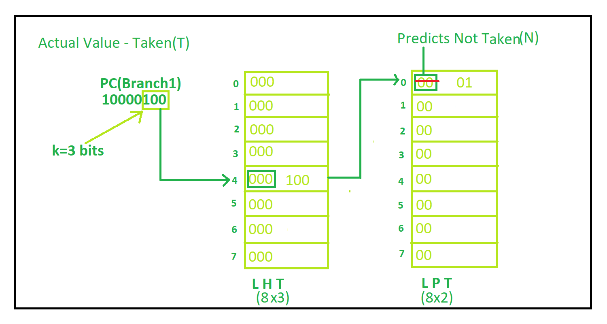

# Lecture 4: Instruction-Level Parallelism

- Main goal of ILP: **Minimize CPI**
  - Pipeline CPI = Ideal Pipeline CPI + *Structural Stalls* + *Data Hazards Stalls* + *Control Stalls*
  - So... reduce stall is our purpose

## 4.1 Instruction-Level Parallelism and Dependences
- Two main limitation of ILP
  - Resource confilicts(basically structural hazards)
  - Dependences(Data hazards)

#### 4.2.1 Data Dependences
- - **True Dependence**(Data dependence): RAW
  - Result must be ready before it can be used
    - Dependent instructions cannot be executed simultaneously
    - Can not be eliminated & out of order execution
  - Between registers, it's more easy to detect and solve(stall, forwarding...)
  - But through memory, it's more difficult to detect and solve(`memory disambiguation`)
    - In modern processor, we use two techniques to solve this problem
      - `Load-Store Queue`(`LSQ``)
      - `Disambiguation at retiremet`
- Name dependence
  - **Anti Dependence**: WAR
    - Write register or memory before read
    - Initial ordering (i before j) must be preserved
  - **Output Dependence**: WAW
    - write to same register or memory
    - order must be preserved
  - to resolve, we can use `register renaming`
    - rename the register to a new one, and use the new one to store the result
    - so we can eliminate the dependence
- Control Dependence
  - ex1)
    ```asm
      Example1:
      add x1,x2,x3
      beq x4,x0,L
      sub x1,x1,x6
    L:
      or  x7,x1,x8
    ```
    - `sub` and `or` are on control dependence
      - they can't reorder after branch or before branch
      - because they have some dependence(`or` depends on `sub`(Not-taken)/`and`(Taken))
  - ex2)
    ```asm
    Example 2:
      add x1,x2,x3
      beq x12,x0,skip
      sub x4,x5,x6
      add x5,x4,x9
    skip:
      or  x7,x8,x9
    ```
      - `x4` register doesn't read after branch so, it could be reordered(Not on control dependence)

## 4.2 Compiler Techniques for Exposing ILP

#### 4.2.1 Pipeline scheduling
- Reorder the instructions to reduce the stalls
  - Insert independent instructions between dependent instructions delay(stall)

ex)
```c
double x[1000];

for (int i = 999; i >= 0; i = i-1)
  x[i] = x[i] + s;
```
```asm 
Loop:  
      fld   F0,0(R1)    // F0 = x[i]
      fadd  F4,F0,F2    // F0 = F0 + s
      fsd   F4,0(R1)    // x[i] = F0
      addi  R1,R1,#-8   // i = i - 1
      bne   R1,R0,Loop  // if i != 0, goto Loop
```
| instruction | description | latency cycles |
|---|---|---|
| fld   | load FP value   | 1 |
| fsd   | store FP value  | 2 |
| faddi | FP ALU op       | 3 |

- no optimization
  ``` execution result
  fld   F0,0(R1)
  stall
  fadd  F4,F0,F2
  stall
  stall
  stall
  fsd   F4,0(R1)
  addi  R1,R1,#-8
  bne   R1,R0,Loop
  ```
- optimized code
  ``` execution result
  fld   F0,0(R1)
  addi  R1,R1,#-8
  fadd  F4,F0,F2
  stall
  stall
  stall
  fsd   F4,0(R1)
  bne   R1,R0,Loop
  ```
  - reorder addi to reduce stall

#### 4.2.2 Loop Unrolling
- Unroll the loop to reduce the number of iterations
  - Reduce the number of branches
  - Increase the number of instructions between branches
  - Increase the number of instructions that can be scheduled in parallel

```asm
  fld   F0,0(R1)
  fadd  F4,F0,F2
  fsd   F4,0(R1)
  fld   F6,0(R1)
  fadd  F8,F6,F2
  fsd   F8,-8(R1)
  fld   F0,0(R1)
  fadd  F12,F0,F2
  fsd   F12,-16(R1)
  fld   F4,0(R1)
  fadd  F16,F4,F2
  fsd   F16,-24(R1)
  addi  R1,R1,#-32
  bne   R1,R0,Loop
```
or
```
  fld   F0,0(R1)
  fld   F6,0(R1)
  fld   F10,0(R1)
  fld   F14,0(R1)
  fadd  F4,F0,F2
  fadd  F8,F6,F2
  fadd  F12,F10,F2
  fadd  F16,F14,F2
  fsd   F4,0(R1)
  fsd   F8,-8(R1)
  fsd   F12,-16(R1)
  fsd   F16,-24(R1)
  addi  R1,R1,#-32
  bne   R1,R0,Loop
```

  - reduce stall by unrolling loop(eliminate branch penalty)

- Cons
  - Code size increases(memory pressure)
  - register pressure increases
  - complexity of code increases

- Problem: we don't know how many times the loop will be executed
  - Solution: `Strip mining!`
    - if we want to unroll loop as `k` time, make all possible length loop(k, k-1, k-2...)
    - then loop k-length code as `n mod k` times
    - finally loop `n div k`-length code

## 4.3 Advanced Hardware Techniques

#### 4.3.1 Basic 2-bit Branch Prediction
- If prediction wrong 2 times, then change prediction

#### 4.3.2 Advanced Branch Prediction
- Correlating predictor
  - in above predictor, we use only one predictor(gloabl predictor)
  - So, rather than make predcitor array, and use each predcitor for kind of cache


- Local predictor
  - make all possible branch address, and use each predictor for each branch

- Tournament predictor
  - combine local and global predictor